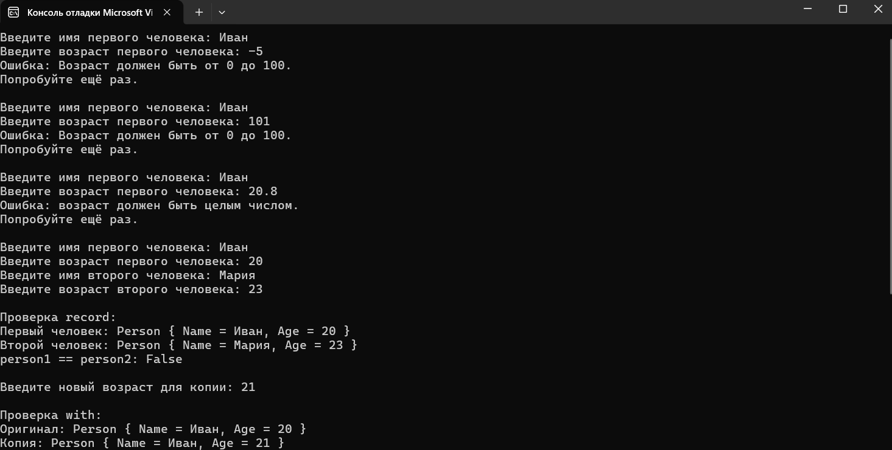
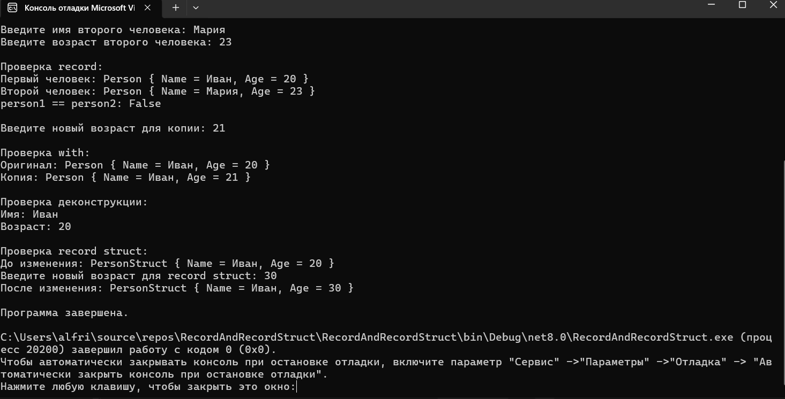
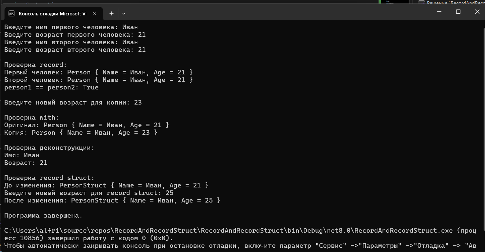

# RecordAndRecordStruct

## Задание «Контрольная точка №14 — record и record struct»

# Вариант 1. Person / PersonStruct
1. public record Person(string Name, int Age);
2. Создайте два экземпляра Person с одинаковыми значениями и продемонстрируйте, что == возвращает true.
3. Используйте with, чтобы создать копию с другим Age, и выведите оригинал и копию, доказав, что оригинал не изменился.
4. Продеконструируйте Person в переменные name и age.
5. Объявите public record struct PersonStruct(string Name, int Age); и продемонстрируйте, что Age можно изменить напрямую (personStruct.Age = 30;) — в отличие от Person.Age.

## Результаты и проверочные ключи
| Действие | Ожидаемый результат |
|---|---|
| `new Person("Иван", 20) == new Person("Иван", 20)` | `True` |
| `person with { Age = 21 }` | новый объект, `Age == 21`; оригинал остался с `Age == 20` |
| `var (name, age) = person;` | `name` и `age` получают значения свойств |
| `personStruct.Age = 30;` напрямую | компилируется и работает (в отличие от `Person.Age`) |

# Результаты

